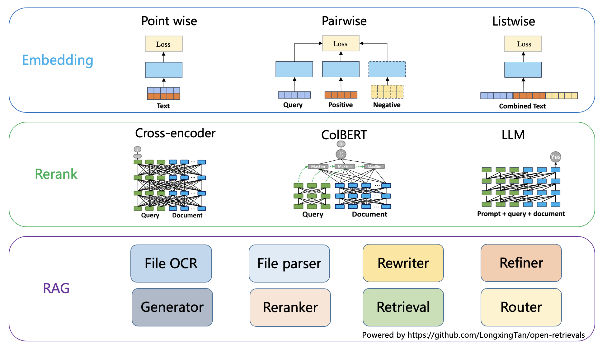

[license-image]: https://img.shields.io/badge/License-Apache%202.0-blue.svg
[license-url]: https://opensource.org/licenses/Apache-2.0
[pypi-image]: https://badge.fury.io/py/open-retrievals.svg
[pypi-url]: https://pypi.org/project/open-retrievals
[pepy-image]: https://pepy.tech/badge/retrievals/month
[pepy-url]: https://pepy.tech/project/retrievals
[build-image]: https://github.com/LongxingTan/open-retrievals/actions/workflows/test.yml/badge.svg?branch=master
[build-url]: https://github.com/LongxingTan/open-retrievals/actions/workflows/test.yml?query=branch%3Amaster
[lint-image]: https://github.com/LongxingTan/open-retrievals/actions/workflows/lint.yml/badge.svg?branch=master
[lint-url]: https://github.com/LongxingTan/open-retrievals/actions/workflows/lint.yml?query=branch%3Amaster
[docs-image]: https://readthedocs.org/projects/open-retrievals/badge/?version=latest
[docs-url]: https://open-retrievals.readthedocs.io/en/master/
[coverage-image]: https://codecov.io/gh/longxingtan/open-retrievals/branch/master/graph/badge.svg
[coverage-url]: https://codecov.io/github/longxingtan/open-retrievals?branch=master
[contributing-image]: https://img.shields.io/badge/contributions-welcome-brightgreen.svg?style=flat
[contributing-url]: https://github.com/longxingtan/open-retrievals/blob/master/CONTRIBUTING.md

<h1 align="center">

</h1>

<div align="center">

  [![LICENSE][license-image]][license-url]
  [![PyPI Version][pypi-image]][pypi-url]
  [![Build Status][build-image]][build-url]
  [![Lint Status][lint-image]][lint-url]
  [![Docs Status][docs-image]][docs-url]
  [![Code Coverage][coverage-image]][coverage-url]
  [![Contributing][contributing-image]][contributing-url]

  **[Documentation](https://open-retrievals.readthedocs.io/en/master/)** | **[中文](https://github.com/LongxingTan/open-retrievals/blob/master/README_zh-CN.md)** | **[日本語](https://github.com/LongxingTan/open-retrievals/blob/master/README_ja-JP.md)**

</div>



**Open-retrievals** unify text embedding, retrieval, reranking and RAG. It's easy, flexible and scalable to fine-tune the model.
- Embedding fine-tuned through point-wise, pairwise, listwise, contrastive learning and LLM.
- Reranking fine-tuned with Cross-Encoder, ColBERT and LLM.
- Easily build enhanced modular RAG, integrated with Transformers, Langchain and LlamaIndex.

| Experiment                    | Model                  | Original | Finetuned | Demo                                                                                                                                                                |
|-------------------------------|------------------------|----------|-----------|---------------------------------------------------------------------------------------------------------------------------------------------------------------------|
| **embed** pairwise finetune   | bge-base-zh-v1.5       | 0.657    | **0.703** | [](https://colab.research.google.com/drive/17KXe2lnNRID-HiVvMtzQnONiO74oGs91?usp=sharing) |
| **embed** LLM finetune (LoRA) | e5-mistral-7b-instruct | 0.651    | **0.699** | [](https://colab.research.google.com/drive/1jj1kBQWFcuQ3a7P9ttnl1hgX7H8WA_Za?usp=sharing) |
| **rerank** cross encoder      | bge-reranker-base      | 0.666    | **0.706** | [](https://colab.research.google.com/drive/1QvbUkZtG56SXomGYidwI4RQzwODQrWNm?usp=sharing) |
| **rerank** colbert            | bge-m3                 | 0.657    | **0.695** | [](https://colab.research.google.com/drive/1QVtqhQ080ZMltXoJyODMmvEQYI6oo5kO?usp=sharing) |
| **rerank** LLM (LoRA)         | bge-reranker-v2-gemma  | 0.637    | **0.706** | [](https://colab.research.google.com/drive/1fzq1iV7-f8hNKFnjMmpVhVxadqPb9IXk?usp=sharing) |

* The eval metrics is MAP in 10% [t2-reranking data](https://huggingface.co/datasets/C-MTEB/T2Reranking).
* Read [more examples](./examples)


## Installation

**With pip**
```shell
pip install transformers
pip install open-retrievals
```


## Quick-start

[](https://colab.research.google.com/drive/1-WBMisdWLeHUKlzJ2DrREXY_kSV8vjP3?usp=sharing)

<details><summary> Embedding from pretrained weights </summary>

```python
from retrievals import AutoModelForEmbedding

sentences = [
    'query: how much protein should a female eat',
    'query: summit define',
    "passage: As a general guideline, the CDC's average requirement of protein for women ages 19 to 70 is 46 grams per day. But, as you can see from this chart, you'll need to increase that if you're expecting or training for a marathon. Check out the chart below to see how much protein you should be eating each day.",
    "passage: Definition of summit for English Language Learners. : 1  the highest point of a mountain : the top of a mountain. : 2  the highest level. : 3  a meeting or series of meetings between the leaders of two or more governments."
]
model_name_or_path = 'intfloat/e5-base-v2'
model = AutoModelForEmbedding.from_pretrained(model_name_or_path, pooling_method="mean")
embeddings = model.encode(sentences, normalize_embeddings=True)
scores = (embeddings[:2] @ embeddings[2:].T) * 100
print(scores.tolist())
```
</details>

<details><summary> Faiss retrieval search </summary>

```python
from retrievals import AutoModelForEmbedding, AutoModelForRetrieval

sentences = ['A dog is chasing car.', 'A man is playing a guitar.']
model_name_or_path = "sentence-transformers/all-MiniLM-L6-v2"
index_path = './database/faiss/faiss.index'
model = AutoModelForEmbedding.from_pretrained(model_name_or_path, pooling_method='mean')
model.build_index(sentences, index_path=index_path)

query_embed = model.encode("He plays guitar.")
matcher = AutoModelForRetrieval()
dists, indices = matcher.search(query_embed, index_path=index_path)
print(indices)
```
</details>

<details><summary> Rerank using pretrained weights </summary>

```python
from retrievals import AutoModelForRanking

model_name_or_path: str = "BAAI/bge-reranker-base"
rerank_model = AutoModelForRanking.from_pretrained(model_name_or_path)
scores_list = rerank_model.compute_score(["In 1974, I won the championship in Southeast Asia in my first kickboxing match", "In 1982, I defeated the heavy hitter Ryu Long."])
print(scores_list)
```
</details>

<details><summary> RAG with LangChain integration </summary>

```shell
pip install langchain
pip install chromadb langchain-chroma
```

[](https://colab.research.google.com/drive/1fJC-8er-a4NRkdJkwWr4On7lGt9rAO4P?usp=sharing)

```python
from retrievals.tools.langchain import LangchainEmbedding, LangchainReranker, LangchainLLM
from retrievals import AutoModelForRanking
from langchain.retrievers import ContextualCompressionRetriever
from langchain.prompts.prompt import PromptTemplate
from langchain.chains import RetrievalQA
from langchain_chroma import Chroma as Vectorstore

persist_directory = './database/faiss.index'
embed_model_name_or_path = "sentence-transformers/all-MiniLM-L6-v2"
rerank_model_name_or_path = "BAAI/bge-reranker-base"
llm_model_name_or_path = "microsoft/Phi-3-mini-128k-instruct"

embeddings = LangchainEmbedding(model_name=embed_model_name_or_path)
vectordb = Vectorstore(
    collection_name="example_collection",
    persist_directory=persist_directory,
    embedding_function=embeddings,
)
retrieval_args = {"search_type" :"similarity", "score_threshold": 0.15, "k": 10}
retriever = vectordb.as_retriever(**retrieval_args)

ranker = AutoModelForRanking.from_pretrained(rerank_model_name_or_path)
reranker = LangchainReranker(model=ranker, top_n=3)
compression_retriever = ContextualCompressionRetriever(
    base_compressor=reranker, base_retriever=retriever
)

llm = LangchainLLM(model_name_or_path=llm_model_name_or_path)

RESPONSE_TEMPLATE = """[INST]
<>
You are a helpful AI assistant. Use the following pieces of context to answer the user's question.<>
Anything between the following `context` html blocks is retrieved from a knowledge base.

    {context}

REMEMBER:
- If you don't know the answer, just say that you don't know, don't try to make up an answer.
- Let's take a deep breath and think step-by-step.

Question: {question}[/INST]
Helpful Answer:
"""

PROMPT = PromptTemplate(template=RESPONSE_TEMPLATE, input_variables=["context", "question"])

qa_chain = RetrievalQA.from_chain_type(
    llm,
    chain_type='stuff',
    retriever=compression_retriever,
    chain_type_kwargs={
        "verbose": True,
        "prompt": PROMPT,
    }
)

user_query = 'Introduce this'
response = qa_chain({"query": user_query})
print(response)
```
</details>


## Fine-tuning

<details><summary> Fine-tune embedding </summary>

```python
import torch.nn as nn
from datasets import load_dataset
from transformers import AutoTokenizer, AdamW, get_linear_schedule_with_warmup, TrainingArguments
from retrievals import AutoModelForEmbedding, RetrievalTrainer, RetrievalCollator
from retrievals.losses import ArcFaceAdaptiveMarginLoss, InfoNCE, SimCSE, TripletLoss

model_name_or_path: str = "sentence-transformers/paraphrase-multilingual-mpnet-base-v2"
batch_size: int = 32
epochs: int = 3

train_dataset = load_dataset('shibing624/nli_zh', 'STS-B')['train']
tokenizer = AutoTokenizer.from_pretrained(model_name_or_path, use_fast=False)
model = AutoModelForEmbedding.from_pretrained(model_name_or_path, pooling_method="mean")
model = model.set_train_type('pairwise')

optimizer = AdamW(model.parameters(), lr=5e-5)
num_train_steps = int(len(train_dataset) / batch_size * epochs)
scheduler = get_linear_schedule_with_warmup(
    optimizer, num_warmup_steps=0.05 * num_train_steps, num_training_steps=num_train_steps
)

training_arguments = TrainingArguments(
    output_dir='./checkpoints',
    num_train_epochs=epochs,
    per_device_train_batch_size=batch_size,
    remove_unused_columns=False,
    logging_steps=100,
)
trainer = RetrievalTrainer(
    model=model,
    args=training_arguments,
    train_dataset=train_dataset,
    data_collator=RetrievalCollator(tokenizer, keys=['sentence1', 'sentence2'], max_lengths=[32, 128]),
    loss_fn=InfoNCE(nn.CrossEntropyLoss(label_smoothing=0.05)),
)
trainer.optimizer = optimizer
trainer.scheduler = scheduler
trainer.train()
```
</details>

<details><summary> Fine-tune LLM embedding </summary>

```python
import torch.nn as nn
from datasets import load_dataset
from transformers import AutoTokenizer, AdamW, get_linear_schedule_with_warmup, TrainingArguments
from retrievals import AutoModelForEmbedding, RetrievalTrainer, RetrievalCollator
from retrievals.losses import InfoNCE, SimCSE, TripletLoss

def add_instructions(example):
    example['query'] = query_instruction + example['query']
    example['positive'] = document_instruction + example['positive']
    return example

model_name_or_path: str = "Qwen/Qwen2-1.5B-Instruct"
batch_size: int = 8
epochs: int = 3
query_instruction = "Retrieve relevant passages that answer the query\nQuery: "
document_instruction = "Document: "

train_dataset = load_dataset('shibing624/nli_zh', 'STS-B')['train']
train_dataset = train_dataset.map(add_instructions)
tokenizer = AutoTokenizer.from_pretrained(model_name_or_path, use_fast=False)
model = AutoModelForEmbedding.from_pretrained(model_name_or_path, pooling_method="last", use_lora=True)
model = model.set_train_type('pairwise', loss_fn=InfoNCE(nn.CrossEntropyLoss(label_smoothing=0.05)))
optimizer = AdamW(model.parameters(), lr=5e-5)
num_train_steps = int(len(train_dataset) / batch_size * epochs)
scheduler = get_linear_schedule_with_warmup(optimizer, num_warmup_steps=0.05 * num_train_steps, num_training_steps=num_train_steps)

training_arguments = TrainingArguments(
    output_dir='./checkpoints',
    num_train_epochs=epochs,
    per_device_train_batch_size=batch_size,
    remove_unused_columns=False,
    logging_steps=100,
)
trainer = RetrievalTrainer(
    model=model,
    args=training_arguments,
    train_dataset=train_dataset,
    data_collator=RetrievalCollator(tokenizer, keys=['sentence1', 'sentence2'], max_lengths=[32, 128]),
)
trainer.optimizer = optimizer
trainer.scheduler = scheduler
trainer.train()
```
</details>

<details><summary> Fine-tune cross-encoder reranking </summary>

```python
from transformers import AutoTokenizer, TrainingArguments, get_cosine_schedule_with_warmup, AdamW
from retrievals import RerankCollator, AutoModelForRanking, RerankTrainer, RerankTrainDataset

model_name_or_path: str = "BAAI/bge-reranker-base"
max_length: int = 128
learning_rate: float = 3e-5
batch_size: int = 4
epochs: int = 3
output_dir: str = "./checkpoints"

train_dataset = RerankTrainDataset("C-MTEB/T2Reranking", positive_key="positive", negative_key="negative", dataset_split='dev')
tokenizer = AutoTokenizer.from_pretrained(model_name_or_path, use_fast=False)
model = AutoModelForRanking.from_pretrained(model_name_or_path)
optimizer = AdamW(model.parameters(), lr=learning_rate)
num_train_steps = int(len(train_dataset) / batch_size * epochs)
scheduler = get_cosine_schedule_with_warmup(
    optimizer,
    num_warmup_steps=0.05 * num_train_steps,
    num_training_steps=num_train_steps,
)

training_args = TrainingArguments(
    learning_rate=learning_rate,
    per_device_train_batch_size=batch_size,
    num_train_epochs=epochs,
    output_dir=output_dir,
    remove_unused_columns=False,
    logging_steps=100,
    report_to="none",
)
trainer = RerankTrainer(
    model=model,
    args=training_args,
    train_dataset=train_dataset,
    data_collator=RerankCollator(tokenizer, max_length=max_length),
)
trainer.optimizer = optimizer
trainer.scheduler = scheduler
trainer.train()
```
</details>

<details><summary> Fine-tune ColBERT reranking </summary>

```python
import os
import transformers
from transformers import (
    AdamW,
    AutoTokenizer,
    TrainingArguments,
    get_cosine_schedule_with_warmup,
)

from retrievals import ColBERT, ColBertCollator, RerankTrainer, RetrievalTrainDataset
from retrievals.losses import ColbertLoss

transformers.logging.set_verbosity_error()
os.environ["WANDB_DISABLED"] = "true"

model_name_or_path: str = "BAAI/bge-m3"
learning_rate: float = 5e-6
batch_size: int = 32
epochs: int = 3
colbert_dim: int = 1024
output_dir: str = './checkpoints'

train_dataset = RetrievalTrainDataset('C-MTEB/T2Reranking', positive_key='positive', negative_key='negative', dataset_split='dev')
tokenizer = AutoTokenizer.from_pretrained(model_name_or_path, use_fast=False)
data_collator = ColBertCollator(
    tokenizer,
    query_max_length=128,
    document_max_length=256,
    positive_key='positive',
    negative_key='negative',
)
model = ColBERT.from_pretrained(
    model_name_or_path,
    colbert_dim=colbert_dim,
    loss_fn=ColbertLoss(use_inbatch_negative=False),
)

optimizer = AdamW(model.parameters(), lr=learning_rate)
num_train_steps = int(len(train_dataset) / batch_size * epochs)
scheduler = get_cosine_schedule_with_warmup(optimizer, num_warmup_steps=0.05 * num_train_steps, num_training_steps=num_train_steps)

training_args = TrainingArguments(
    learning_rate=learning_rate,
    per_device_train_batch_size=batch_size,
    num_train_epochs=epochs,
    output_dir=output_dir,
    remove_unused_columns=False,
    logging_steps=100,
)
trainer = RerankTrainer(
    model=model,
    args=training_args,
    train_dataset=train_dataset,
    data_collator=data_collator,
)
trainer.optimizer = optimizer
trainer.scheduler = scheduler
trainer.train()
```
</details>

<details><summary> Fine-tune LLM reranking </summary>

```python
from transformers import (
    AdamW,
    AutoTokenizer,
    TrainingArguments,
    get_cosine_schedule_with_warmup,
)

from retrievals import (
    LLMRanker,
    LLMRerankCollator,
    RerankTrainer,
    RetrievalTrainDataset,
)
from retrievals.losses import TokenLoss

model_name_or_path: str = "Qwen/Qwen2-1.5B-Instruct"
max_length: int = 512
learning_rate: float = 3e-5
batch_size: int = 8
epochs: int = 3
task_prompt: str = (
    """Given a query A and a passage B, determine whether the passage contains an answer to the query"""
    """by providing a prediction of either 'Yes' or 'No'."""
)

tokenizer = AutoTokenizer.from_pretrained(model_name_or_path, use_fast=False)
train_dataset = RetrievalTrainDataset(
    data_name_or_path='C-MTEB/T2Reranking',
    positive_key='positive',
    negative_key='negative',
    query_instruction='A: ',
    document_instruction='B: ',
    dataset_split='dev',
)
data_collator = LLMRerankCollator(tokenizer=tokenizer, max_length=max_length, prompt=task_prompt, add_target_token='Yes')
token_index = tokenizer('Yes', add_special_tokens=False)['input_ids'][-1]
model = LLMRanker.from_pretrained(
    model_name_or_path,
    causal_lm=True,
    use_fp16=True,
    loss_fn=TokenLoss(token_index=token_index),
    use_lora=True,
)

optimizer = AdamW(model.parameters(), lr=learning_rate)
num_train_steps = int(len(train_dataset) / batch_size * epochs)
scheduler = get_cosine_schedule_with_warmup(
    optimizer,
    num_warmup_steps=0.05 * num_train_steps,
    num_training_steps=num_train_steps,
)

training_args = TrainingArguments(
    learning_rate=learning_rate,
    per_device_train_batch_size=batch_size,
    num_train_epochs=epochs,
    output_dir="./checkpoints",
    remove_unused_columns=False,
)
trainer = RerankTrainer(
    model=model,
    args=training_args,
    train_dataset=train_dataset,
    data_collator=data_collator,
)
trainer.optimizer = optimizer
trainer.scheduler = scheduler
trainer.train()
```
</details>


## RAG module
coming soon


## Reference & Acknowledge
- [UKPLab/sentence-transformers](https://github.com/UKPLab/sentence-transformers)
- [luyug/Dense](https://github.com/luyug/Dense)
- [FlagOpen/FlagEmbedding](https://github.com/FlagOpen/FlagEmbedding)
